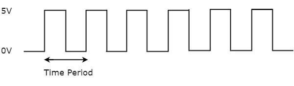
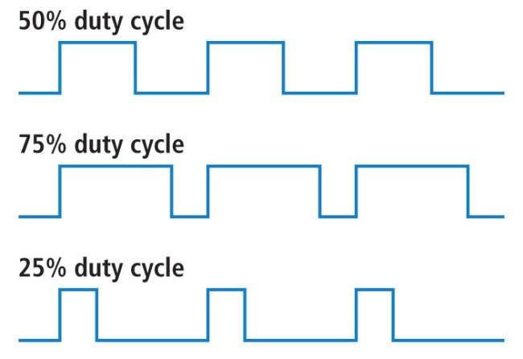
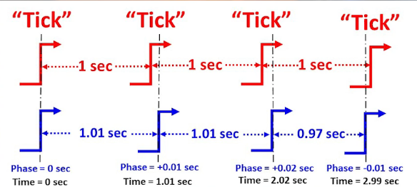
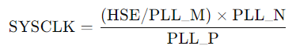
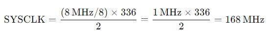
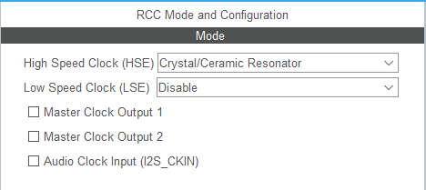
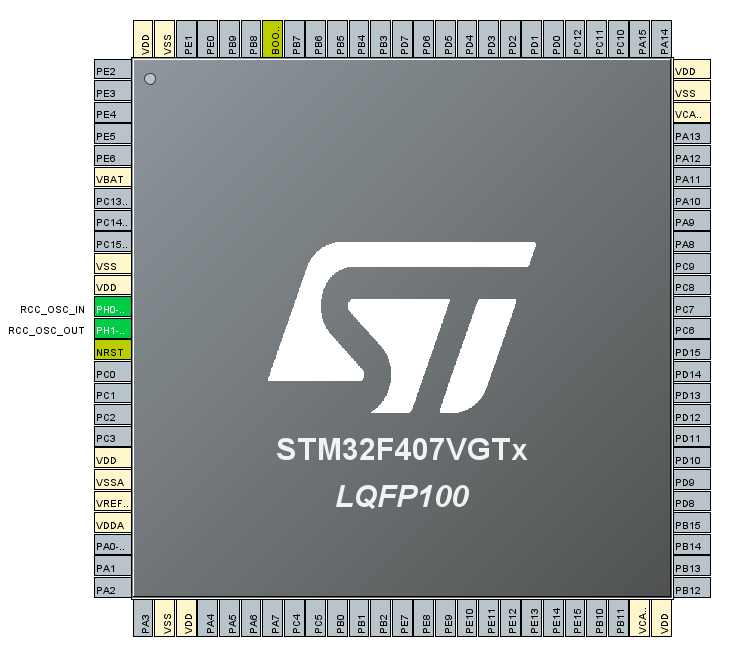
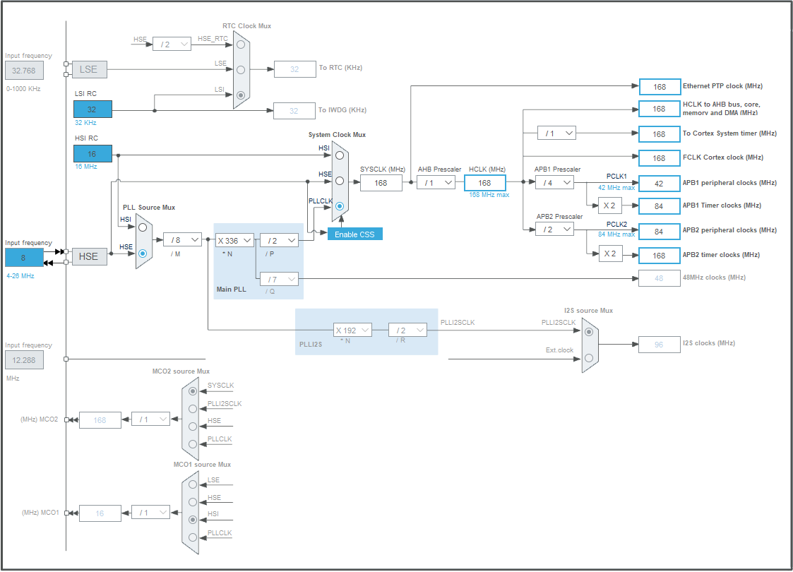
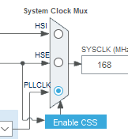

### SAAT SİNYALİ (CLOCK SIGNAL)

Clock signal (saat sinyali), bir elektronik devredeki bileşenlerin senkronize çalışmasını sağlamak için kullanılan düzenli, tekrarlayan bir kare dalga sinyalidir. Saat sinyali, dijital devrelerde zamanlama ve işlem sıralaması için referans olarak kullanılır. Özellikle mikroişlemcilerde ve mikrodenetleyicilerde, clock signal, işlemciye ve diğer çevre birimlerine ne zaman işlem yapmaları gerektiğini bildirir.

### Clock Signal’in Temel Özellikleri:

Frekans (Frequency): Saat sinyalinin saniyede kaç kez tekrarladığını belirler ve hertz (Hz) cinsinden ölçülür. Örneğin, bir mikrodenetleyici 72 MHz'de çalışıyorsa, bu, her saniye 72 milyon döngüde işlem yaptığı anlamına gelir.

Periyot (Period): Bir clock sinyalinin tam bir döngüsünün (1 tam yüksek ve düşük sinyal geçişi) tamamlanması için geçen zamandır. Periyot, frekansın tersidir. Yani, frekans arttıkça periyot kısalır.

Görev Döngüsü (Duty Cycle): Clock sinyalinin "yüksek" olduğu zamanın toplam döngüye oranıdır. Bir kare dalga için genellikle %50 görev döngüsü kullanılır, bu da sinyalin yarı süre boyunca yüksek ve diğer yarısında düşük olduğu anlamına gelir.

Faz (Phase): Saat sinyali, aynı frekansta olan iki sinyal arasında bir zaman gecikmesi olduğunda, bu sinyallerin fazı farklı olur. Saat sinyalleri arasında faz farkı olması, iki farklı modüle sinyal sağlandığında zamanlama uyuşmazlığına neden olabilir.

### Saat Sinyali Nasıl Çalışır?

Saat sinyali, devredeki tüm bileşenlere düzenli bir zamanlama referansı sağlar. Bir mikrodenetleyicide, işlemci bir clock pulse (saat darbesi) aldığında, bir sonraki işlemi gerçekleştirir. Clock sinyalinin her yüksek (HIGH) ve düşük (LOW) durumu işlemciye bir "zamanı geldi" sinyali verir. Örneğin, bir işlemci saat sinyali yüksekken veri alabilir ve saat sinyali düşükken işlemi tamamlayabilir. Saat sinyali genellikle bir osilatör tarafından üretilir. Bu osilatör, sabit frekanslı bir sinyal üretir ve bu sinyal daha sonra tüm sisteme dağıtılır. 

### Saat Sinyali Neden Önemlidir?

Senkronizasyon: Dijital devrelerdeki bileşenlerin senkronize çalışması saat sinyaliyle sağlanır. Her bileşen aynı clock pulse ile çalıştığında veri doğru zamanda iletilir ve işlenir.

Performans: Frekans ne kadar yüksekse, bir işlemci veya dijital devre o kadar hızlı çalışır, çünkü her clock döngüsünde yeni bir işlem gerçekleştirilebilir.

Zamanlama: Mikrodenetleyici içerisindeki çevre birimlerin (UART, I2C, SPI vb.) zamanlamaları saat sinyali ile belirlenir. Saat sinyalinin doğruluğu, bu çevre birimlerinin verimli çalışmasını sağlar.

### STM32 Mikrodenetleyicilerde Saat Sinyali

STM32 mikrodenetleyiciler birden fazla saat kaynağı kullanabilirler. Başlıca saat kaynakları şunlardır:

HSE (High-Speed External Oscillator): Harici bir kristal veya osilatör kullanarak 4 MHz - 26 MHz aralığında çalışabilir. Daha yüksek doğruluk ve kararlılık için tercih edilir.

HSI (High-Speed Internal Oscillator): 8 MHz sabit frekansında çalışan dahili osilatördür. Dış kristal gerektirmeyen durumlar için uygundur.

LSE (Low-Speed External Oscillator): 32.768 kHz harici kristal kullanır. Genellikle gerçek zamanlı saat (RTC) gibi düşük güç uygulamaları için kullanılır.

LSI (Low-Speed Internal Oscillator): Yaklaşık 40 kHz civarında çalışan dahili bir osilatördür ve düşük hassasiyet gerektiren düşük güçlü uygulamalarda kullanılır.

PLL (Phase-Locked Loop): Saat frekansını artırmak için kullanılan bir frekans çarpanıdır. HSE veya HSI sinyaliyle beslenir ve yüksek frekanslı saat sinyali üretmek için kullanılır.

### Saat Konfigürasyonu (Clock Configuration)

Saat sinyallerinin doğru bir şekilde yapılandırılması için STM32'nin RCC (Reset and Clock Control) modülünden yararlanılır. Burada, sistem saatini, çevre birim saatlerini ve diğer saat sinyallerini ayarlamak mümkündür. RCC modülü ile yapılabilecek bazı işlemler şunlardır:

SYSCLK: Sistemin ana saatidir ve CPU'nun çalışma hızını belirler. HSE, HSI veya PLL'den biri seçilerek oluşturulur.

AHBCLK: AHB (Advanced High-performance Bus) veri yolunun saat frekansını belirler. SYSCLK sinyali kullanılarak bölünebilir.

APB1CLK ve APB2CLK: APB (Advanced Peripheral Bus) veri yollarının saat frekanslarını belirler. APB1 düşük hızlı çevre birimlerine, APB2 ise yüksek hızlı çevre birimlerine hizmet eder.

### PLL Kullanımı (Phase-Locked Loop)

PLL, STM32’de saat frekansını yükseltmek için kullanılır. Örneğin, harici bir HSE sinyalinden 8 MHz alınarak, PLL ile bu sinyal çarpılabilir ve 72 MHz gibi bir frekansa yükseltilebilir.

STM32'de sistem saat frekansı (SYSCLK) şu şekilde hesaplanır:

HSE: Harici osilatör (High-Speed External), bu durumda 8 MHz.

PLL_M: PLL devresinin giriş frekansını düşürmek için kullanılan bir bölme faktörü. HSE frekansı bu değerle bölünerek PLL giriş frekansı elde edilir.

PLL_N: PLL devresinde kullanılan bir çarpan. Giriş frekansı bu çarpan ile çarpılarak daha yüksek bir frekans elde edilir.

PLL_P: PLL devresinin çıkış frekansını belirlemek için kullanılan bir bölme faktörü. Çıkış frekansı bu değerle bölünerek SYSCLK elde edilir.

Eğer HSE = 8 MHz ise ve şu PLL parametreleri verilmişse:

PLL_M = 8   PLL_N = 336 PLL_P = 2

Formüle bu değerleri yerleştirirsek:

Bu da STM32 sistem saati olarak 168 MHz elde edildiğini gösterir.

### Clock Tree (Saat Ağacı)

STM32 mikrodenetleyicilerdeki saat yapılandırması bir "Clock Tree" (saat ağacı) üzerinden yönetilir. Bu ağaç, sistem saatini ve çevre birim saatlerini yönetir. Örneğin, AHB, APB1 ve APB2 veri yolları farklı saat kaynaklarına bağlı olabilir ve her biri için farklı bölme faktörleri uygulanabilir.

### Clock Security System (CSS)

Clock Security System (CSS), STM32 mikrodenetleyicilerde saat sinyalinin kesilmesi veya bozulması durumunda devreye girer. Örneğin, harici HSE kristali bozulduğunda sistem HSI'ye geçiş yaparak çalışmayı sürdürür.

### STM32CubeIDE'de Saat Konfigürasyonu

1) STM32CubeIDE'yi açın ve yeni bir proje oluşturun. Mikrodenetleyici modelinizi seçin (örneğin, STM32F4, STM32F1, STM32L4 serileri).

2) STM32CubeIDE'de Pinout & Configuration sekmesindeki RCC (Reset and Clock Control) bölümü, STM32 mikrodenetleyicisinin saat (clock) ve sıfırlama (reset) ayarlarını yönetmek için kullanılır. Bu bölüm, sistemin ana saat kaynağını, PLL ayarlarını, çevre birimleri için saat konfigürasyonlarını ve düşük güç modları için saat sinyali yapılandırmalarını içerir. 

- High Speed Clock (HSE): Harici bir osilatör veya kristal kullanarak mikrodenetleyiciye yüksek frekanslı bir saat sinyali sağlar.

    - Crystal/Ceramic Resonator: Harici bir kristal kullanmak istiyorsanız bu seçeneği aktif hale getirin.
    - Bypass Clock Source: Eğer bir osilatör kullanıyorsanız, bu seçeneği etkinleştirebilirsiniz. Bu seçenek, osilatör sinyalinin doğrudan HSE olarak kullanılmasını sağlar.

3) Proje oluşturduktan veya açtıktan sonra STM32CubeIDE'de açılan Pinout & Configuration ekranında üst kısımdaki sekmelerden Clock Configuration'a tıklayın.

4) Clock Configuration sekmesinde bir saat ağacı (clock tree) görünümüyle karşılaşacaksınız. Bu ekran, saat kaynaklarının nasıl seçileceğini, PLL konfigürasyonlarını ve çeşitli veri yolları (AHB, APB) ve çevre birimleri için saat frekanslarının nasıl ayarlanacağını gösterir.

5) SYSCLK (System Clock) kaynağını seçmek için, saat ağacındaki "System Clock Mux" menüsünden bir kaynak seçilebilir. Genellikle 3 seçenek bulunur: HSI, HSE, PLL.

6) Saat konfigürasyonunu yaptıktan sonra Ctrl+S tuşuna basarak ardından ekrana gelen mesajı onaylarayarak, bu yapılandırmaların kodlara dönüştürülmesini sağlayabilirsiniz.
